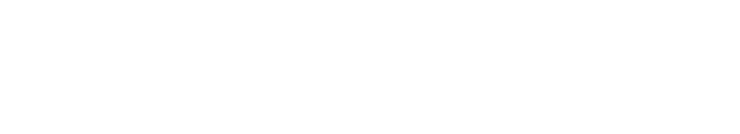
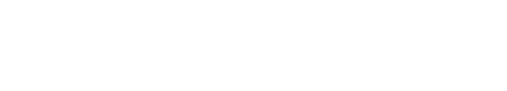
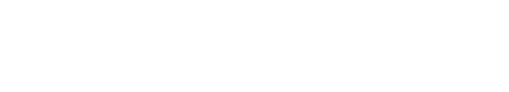

    

    

Loving open source software and GTK spirits, I build things that almost feel like silence... the kind Murakami would leave between lines.

And somewhere between Kotlin flows and React thoughts, I’m still searching for something precise and unnamed. Maybe in my one country I left, maybe in my old self.

 

 

    

    

  
  
  
  
  
  
    
    

    

  
  
  
    
  
  
  

    

  
  
  
  
  
  
     

2026 - kosail in the korealm 
With love, from Honduras. Mi país cinco estrellas. 

